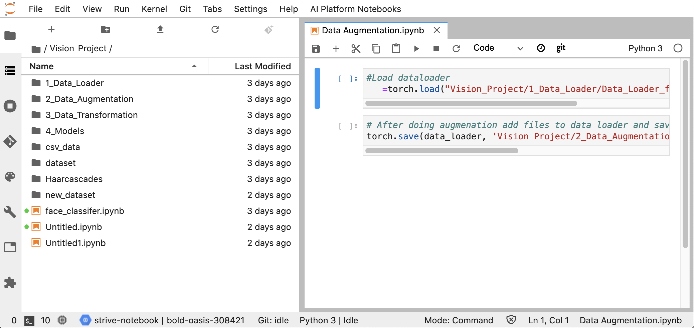
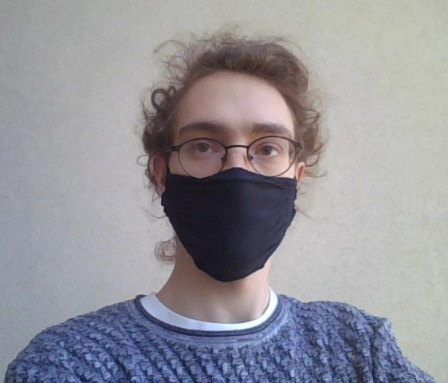
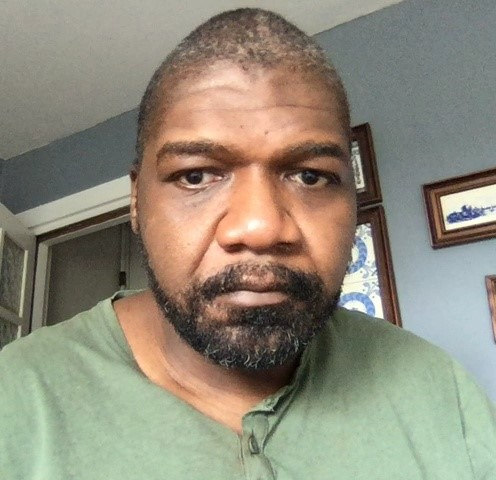
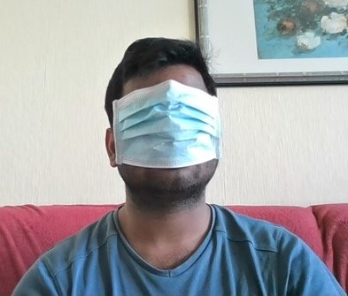
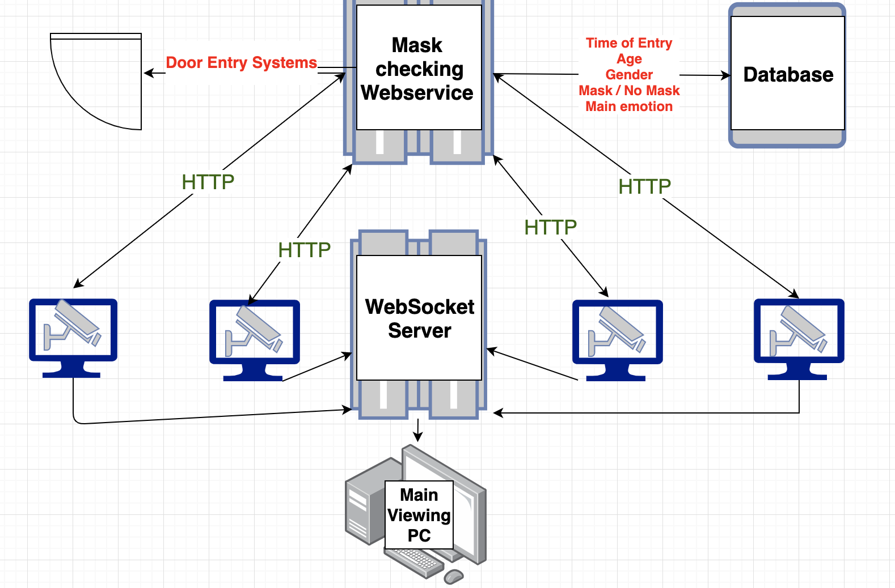
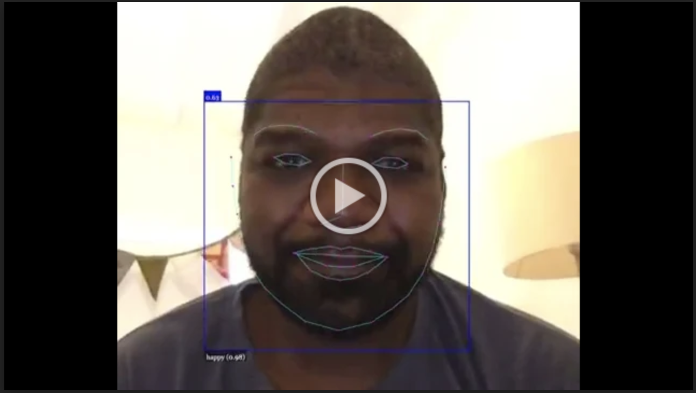

# Build Week 3 👷
#### Focus on Deep Learning and Computer Vision modules. 📚

# Project on Face Mask Detection 😷


# Team Cruise 🚗
* [Luca Pianta](https://github.com/lpianta)
* [Charles_Degraft-Johnson](https://github.com/charleeboy)
* [Sai Mohan Reddy Dalli](https://github.com/smr-dalli)

# Technologies and tools 🧰
    

# Infrastructure 🧰
A jupyter lab was created on Google cloud, which acted as a shared workspace and code hub. This environment was also linked to github. A data pipeline in the form a directory structure was created, allowing multiple people to work on different stages of the pipeline. 



# Tasks 📝
## Custom Datasets 📸
* Using Computer Vision (cv2), We capture pictures of MASK, No MASK, and BAD MASK with our web camera.
* Save the images and label them in the respective folders by drawing rectangular bounding boxes around the face and key points around the eyes.
* Merged the mask, no mask, and bad mask images of our peers to create a large dataset to train the model.

  

##  Models and training 💻
### ResNet18

We started our classification task by using [PyTorch](https://pytorch.org/) and Transfer Learning.  <br>
Pytorch gives the opportunity to load some pretrained model, and we choose ResNet18 as our first approach. ResNet-18 is a convolutional neural network that is 18 layers deep. You can load a pretrained version of the network trained on more than a million images from the ImageNet database and the pretrained network can classify images into 1000 object categories. <br>

[](https://i.stack.imgur.com/pkPi3.png "ResNet 18 Architecture")

Since our classification has only 3 possible output ('MASK', 'BAD_MASK', 'NO_MASK'), we froze all the training made on the first layers and changed the last fully connected one.

```python
for param in model.parameters():
    param.requires_grad = False

model.fc = nn.Sequential(nn.Linear(512, 10),
                                 nn.ReLU(),
                                 nn.Dropout(0.2),
                                 nn.Linear(10, 3),
                                 nn.LogSoftmax(dim=1))
```
<br>

Since the network is pretrained, it requires input in a specific format, so we had to define a transform for that. <br>

```python
preprocess = transforms.Compose([
    transforms.Resize((224,224)),
    transforms.ToTensor(),
    transforms.Normalize(mean=[0.485, 0.456, 0.406], std=[0.229, 0.224, 0.225]),
])
```
<br>

In the first line, we instanciate one object of the class transforms.<br>
On line 2, we resize the image to the required size for ResNet.<br>
On line 3, we transform the image to tensor, since it's the datatype required by PyTorch.<br>
On line 4, we apply the mean and the standard deviation that is fixed for the pretrained model.
<br>

After training the model and getting good result, we saved it in ONNX format, in order to be able to implement it in [OpenCV](https://opencv.org/) to make prediction in real time.

---
### Fast.AI 💻

We decided to try another approach based on [Fast.AI](https://docs.fast.ai/index.html), a more high-level library build on PyTorch. <br>

To start, we had to load all the data in a folder, with each class in his own subfolder. After that, the library requires only one line to load all the data:  <br>
```python
data  = ImageDataBunch.from_folder(PATH, ds_tfms=get_transforms(), size=sz, bs=bs, valid_pct=0.2).normalize(imagenet_stats)
```
<br>
We have to define the path were the data is stored, the size required, the batchsize, the transofrmation and the normalization. Since we are using a different version of ResNet here, the transformation is conveniently stored inside `imagenet_stats`. It also automatically divides data in test and validation <br>

One line is enough to create the model, as you can see we decided to try with ResNet34 instead of Resnet18, which has 34 layer instead of 18.

```python
learn = cnn_learner(data, models.resnet34, metrics=accuracy)
```
<br>

Also to find the correct learning rate, only two lines of code are required: <br>
```python
learn.lr_find();
learn.recorder.plot()
```
<br>

This will plot the learning rate against the loss, allowing us to choose the best range.

[](https://i.ibb.co/3v0mVq4/lr-plot.png "LR vs Loss plot")

<br>

After this, the training stage is done again in just one line: <br>

```python
learn.fit_one_cycle(4, max_lr=slice(1e-3,1e-1))
```
<br>

And the output is pretty nice formatted and with a very good score: <br>

[](https://i.ibb.co/F7NW2cN/training-fastai.png "FastAI Output")

<br>

Once the trained is done, we saved this model too to integrate the better one for the live detection.

# Front End Development 📝

## Face-Api.js 💻
As we wanted the detection functionaity to be avaiable on other devices, we also decided to use the retrain pretrained Face-Api.js models.
[Face.Api.js](face-api.js)
<br>


```javascript
const video = document.getElementById('video');

navigator.getUserMedia = navigator.getUserMedia || navigator.webkitGetUserMedia || navigator.mozGetUserMedia || navigator.msGetUserMedia;
Promise.all([
  faceapi.loadFaceLandmarkModel("http://127.0.0.1:5000/static/models/"),
  faceapi.loadFaceRecognitionModel("http://127.0.0.1:5000/static/models/"),
  faceapi.loadTinyFaceDetectorModel("http://127.0.0.1:5000/static/models/"),
  faceapi.loadFaceLandmarkModel("http://127.0.0.1:5000/static/models/"),
  faceapi.loadFaceLandmarkTinyModel("http://127.0.0.1:5000/static/models/"),
  faceapi.loadFaceRecognitionModel("http://127.0.0.1:5000/static/models/"),
  faceapi.loadFaceExpressionModel("http://127.0.0.1:5000/static/models/"),
])
  .then(startVideo)
  .catch(err => console.error(err));
  ```
<br>

These models run in the browser rather than the server improving performance. The webapp will deployed in a docker container, with the mask detection implemented as webservice called from the javascript. These models found the contours of the face as well as estimating the age, gender and emotion of the people in the camera view. The models work for individals and well as groups of people.
<br>



<br>


##  Front End Implementation & Server Infrastructure💻
The front end has been implemented using Flask, HTML and Javascript, calling flask webservice doing the mask inference. Web sockets were implemented to allow remote viewing of multiple cameras. The mask inference was implemented as a webservice as it would allow quick and easy scaleability by implementing it using a service like "Amazon Lambda" or "Google Cloud Functions", as well as help ease integration with other systems, e.g. security and building access.
The front end functionality was also implemented using OPEN CV, allowing the functionality to run on any computer with a webcam.

#  The results💻
[](https://drive.google.com/file/d/1WKQkFdYYivYrOxYo3IMZktA9U_m522L8/view)
[](https://drive.google.com/file/d/1q_7XRNv2O1TB1vsGK431D42QR5Dmrlkw/view)


