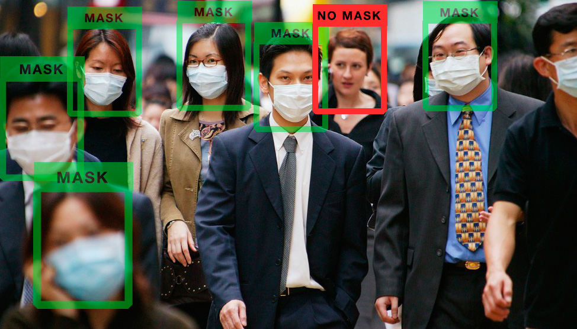
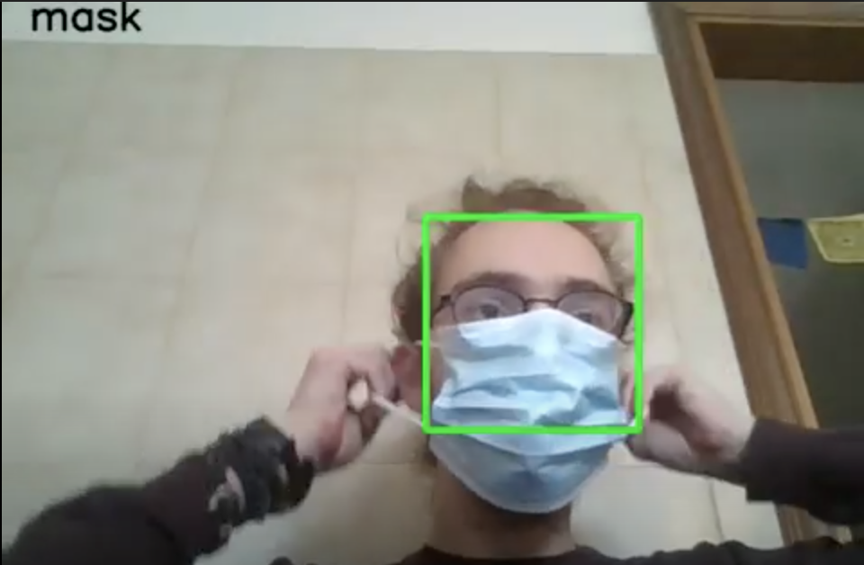
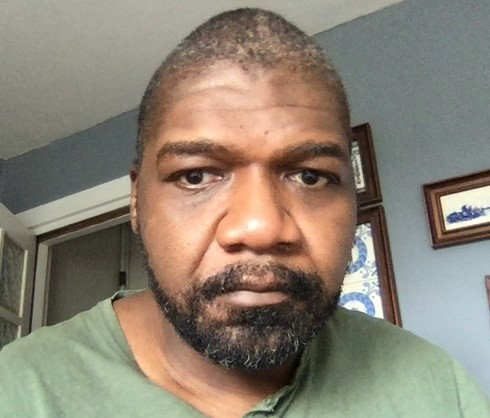

#  Models and training
---
### ResNet18

We started our classification task by using [PyTorch](https://pytorch.org/) and Transfer Learning.  <br>
Pytorch gives the opportunity to load some pretrained model, and we choose ResNet18 as our first approach. ResNet-18 is a convolutional neural network that is 18 layers deep. You can load a pretrained version of the network trained on more than a million images from the ImageNet database and the pretrained network can classify images into 1000 object categories. <br>

[](https://i.stack.imgur.com/pkPi3.png "ResNet 18 Architecture")

Since our classification has only 3 possible output ('MASK', 'BAD_MASK', 'NO_MASK'), we froze all the training made on the first layers and changed the last fully connected one.

```python
for param in model.parameters():
    param.requires_grad = False

model.fc = nn.Sequential(nn.Linear(512, 10),
                                 nn.ReLU(),
                                 nn.Dropout(0.2),
                                 nn.Linear(10, 3),
                                 nn.LogSoftmax(dim=1))
```
<br>

Since the network is pretrained, it requires input in a specific format, so we had to define a transform for that. <br>

```python
preprocess = transforms.Compose([
    transforms.Resize((224,224)),
    transforms.ToTensor(),
    transforms.Normalize(mean=[0.485, 0.456, 0.406], std=[0.229, 0.224, 0.225]),
])
```
<br>

In the first line, we instanciate one object of the class transforms.<br>
On line 2, we resize the image to the required size for ResNet.
On line 3, we transform the image to tensor, since it's the datatype required by PyTorch.
On line 4, we apply the mean and the standard deviation that is fixed for the pretrained model.
<br>

After training the model and getting good result, we saved it in ONNX format, in order to be able to implement it in [OpenCV](https://opencv.org/) to make prediction in real time.


# Build Week 3
#### Focus on Deep Learning and Computer Vision modules.

# Project on Face Mask Detection



# Team Cruise
* [Luca Pianta](https://github.com/lpianta)
* [Charles_Degraft-Johnson](https://github.com/charleeboy)
* [Sai Mohan Reddy Dalli](https://github.com/smr-dalli)

# Tasks
## Day 1: Custom Datasets 
* Using Computer Vision (cv2), We capture pictures of MASK, No MASK, and BAD MASK with our web camera.
* Save the images and label them in the respective folders by drawing rectangular bounding boxes around the face and key points around the eyes.
* Merged the mask, no mask, and bad mask images of our peers to create a large dataset to train the model.

  

### Day 2: 
